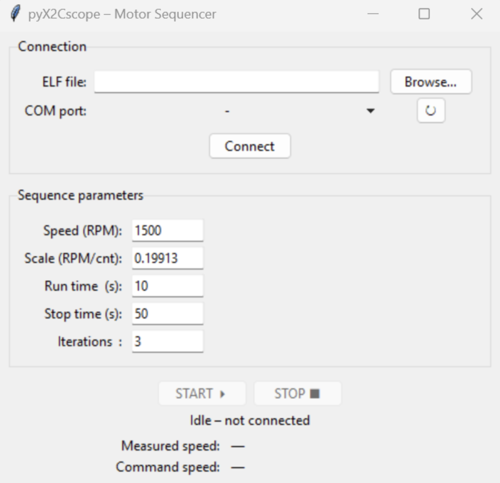

# pyX2Cscope Start-Stop GUI

**Last updated:** June 26, 2025

This is a Python GUI built with `tkinter` that uses [pyX2Cscope](https://github.com/X2Cscope/pyx2cscope) to control a motor through a serial COM port and an ELF file. It’s designed to work with Microchip’s MCAF-based projects and allows the user to safely run a start–stop motor sequence with real-time feedback.

## Features

- Connects to MCAF-compatible targets using a selected COM port and ELF file
- Set speed in RPM, run/stop times, and number of cycles
- Read back measured and commanded motor speed
- Dummy mode available for testing the GUI without hardware
- Can be converted to a standalone `.exe` using `auto-py-to-exe`

## Requirements

- Python 3.11+
- [pyX2Cscope](https://pypi.org/project/pyx2cscope/)
- Windows (for `.exe` build, optional)

## Setup

1. Create a virtual environment:
   ```bash
   python -m venv venv
   venv\Scripts\activate
   ```

2. Install the required library:
   ```bash
   pip install pyx2cscope
   ```

3. (Optional) Test that the tool is installed:
   ```bash
   pyx2cscope
   ```

4. Run the script:
   ```bash
   python motor_gui.py
   ```

## Usage

1. Launch the GUI and select your ELF file and COM port.
2. Set the following parameters:
   - Speed (RPM)
   - Scale (RPM/count)
   - Run time (in seconds)
   - Stop time (in seconds)
   - Number of iterations
3. Press **Start** to begin the sequence. You can stop it manually using the **Stop** button.
4. The GUI will show live speed readouts based on `velocityReference` and `velocityMeasured`.

## Screenshots and Video

**Demo GIF:**  


**GUI Interface:**  


**Video walkthrough:**  
[Watch on YouTube](https://youtu.be/3JTQvVq21s4)

## How to Determine RPM/Count Scaling

To calculate the correct value for “RPM per count”, refer to the HTML report generated by MotorBench:

```
<YourProject>.X/mcc_generated_files/motorBench/aux-files/report.html
```

The correct scale is usually highlighted in blue in that file. An example value is:

```
0.19913 RPM/ct
```

Copy this value into the GUI’s scale field.

## Making a Standalone .exe (Optional)

To convert the script into an executable:

1. Install the tool:
   ```bash
   pip install auto-py-to-exe
   ```

2. Launch it:
   ```bash
   auto-py-to-exe
   ```

3. In the UI:
   - Select `motor_gui.py`
   - Set to one-file mode
   - Window-based app (no console)
   - Add any icons or additional files if needed

4. Build the project and distribute the `.exe` file.

## References

- [pyX2Cscope on GitHub](https://github.com/X2Cscope/pyx2cscope)
- [pyX2Cscope on PyPI](https://pypi.org/project/pyx2cscope/)
- [X2Cscope documentation](https://x2cscope.github.io/)
- [tkedit GUI builder (optional)](https://tkedit.pages.dev/ui/)
- [auto-py-to-exe on PyPI](https://pypi.org/project/auto-py-to-exe/)

## Notes

This GUI was originally created using a set of LLM-generated prompts and refined manually. The scope variables used in this GUI are:

- `motor.apiData.velocityReference`
- `motor.apiData.velocityMeasured`
- `motor.apiData.runMotorRequest`
- `motor.apiData.stopMotorRequest`
- `app.hardwareUiEnabled`

To test the UI without hardware, you can enable dummy mode by setting `USE_SCOPE = False` in the script.
